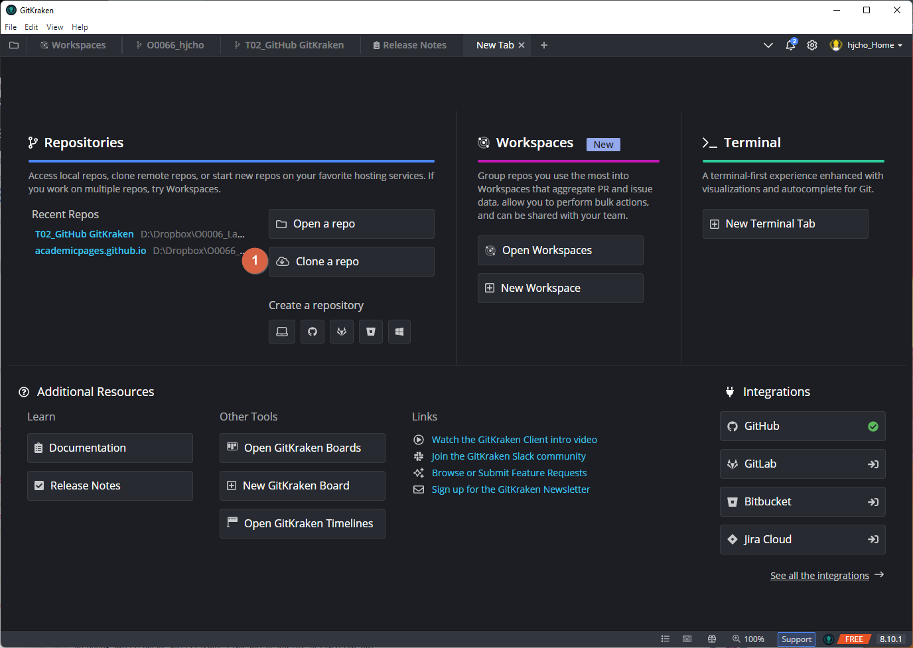
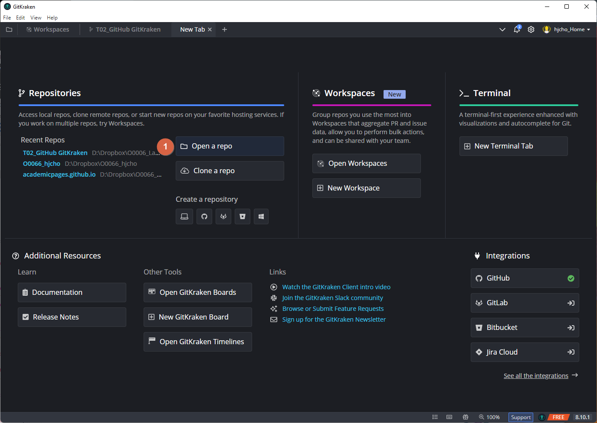
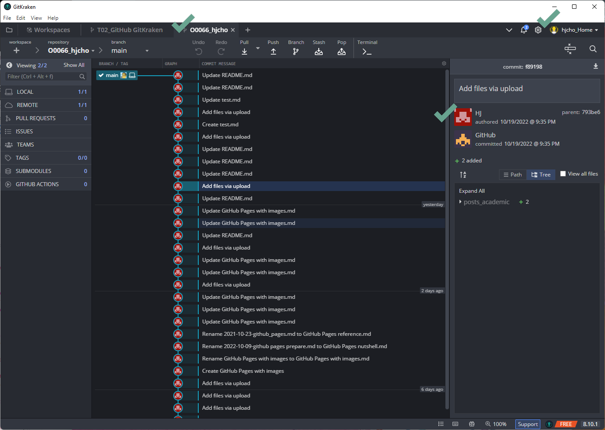
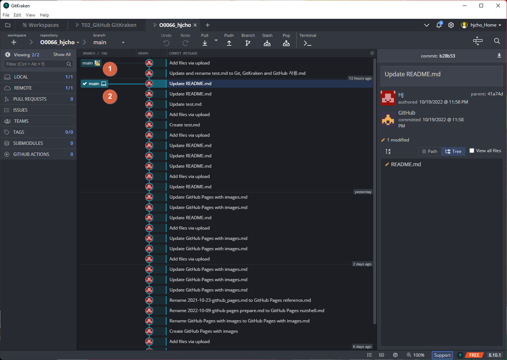
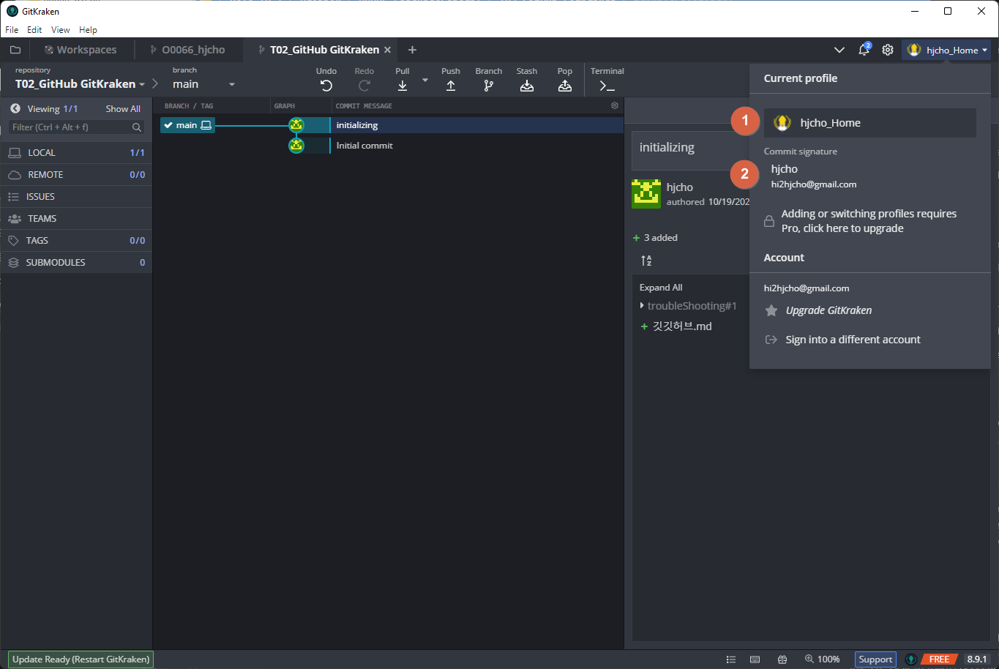

테스트

로컬에서 Git을 사용하기 위해서는 무조건 Git을 다운받아야 하는줄 알았으나 꼭 그런 것 같지는 않다.
[GITHUB 입문] Git과 GitHub의 차이 (https://taewow.tistory.com/8)
[GITHUB 입문] Git 설치하기(2.35.1 이상, 상세한 설치법) https://taewow.tistory.com/13

GitKraken 설치 후 `Clone a repo` 하니 리모트(GirHub)에 존재하는 repo을 로컬에 다운받을 수 있었다.

이후 다운받은 폴더는 별도 init 필요없이 GitKraken에서 `Open a repo`하니 모든 commit 히스토리를 확인 할 수 있음. repository라는 용어는 일반 폴더와는 다르게 git 기능을 가진 폴더라 인식하면 될 것 같다.

한편 리모트(GitHub)에서 직접 파일을 수정하는 경우 해당 수정 내용에 대한 로그를 GitKraken에서 자동으로 확인할 수 있었다. 별도의 추가적인 조치가 없어도 로컬에서 업데이트된 깃로그를 확인할 수 있다는 의미는, GitKraken에서 GitHub와 정보를 주고 받는다는 의미인 것인가?

merge, push, fetch 등의 개념에 대해서 알아본다.
- https://bunnnybin.tistory.com/37
- https://velog.io/@danna-lee/%EA%B0%9C%EB%B0%9C-%ED%98%91%EC%97%85%EC%97%90%EC%84%9C-%EA%B9%83-%EA%B9%83%ED%81%AC%EB%9D%BC%EC%BC%84-%EC%82%AC%EC%9A%A9%ED%95%98%EA%B8%B0

