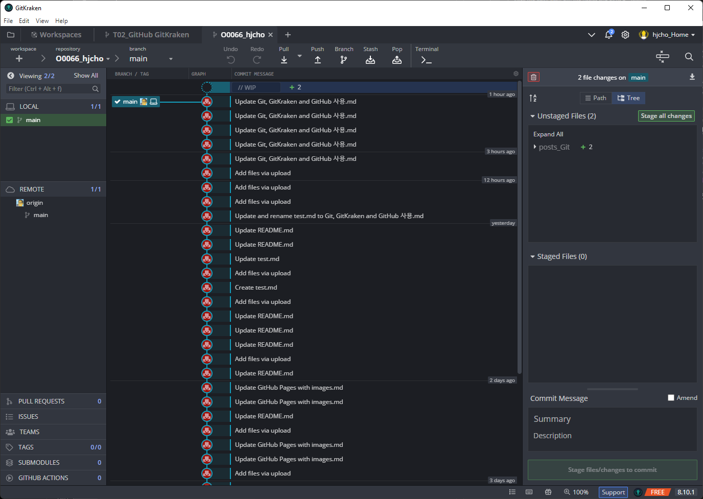
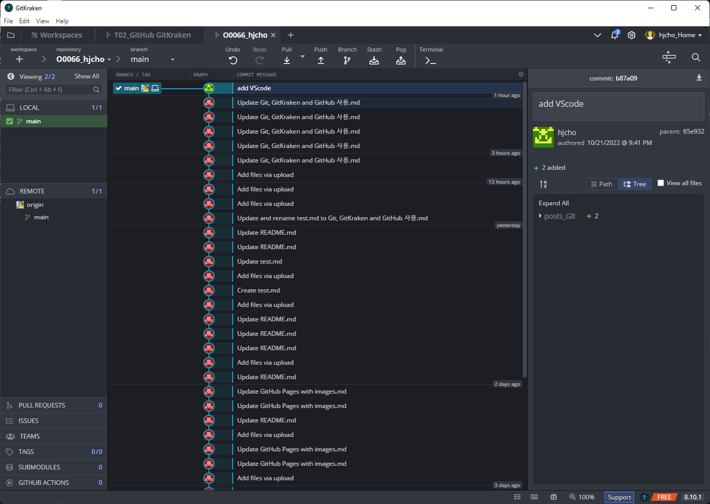
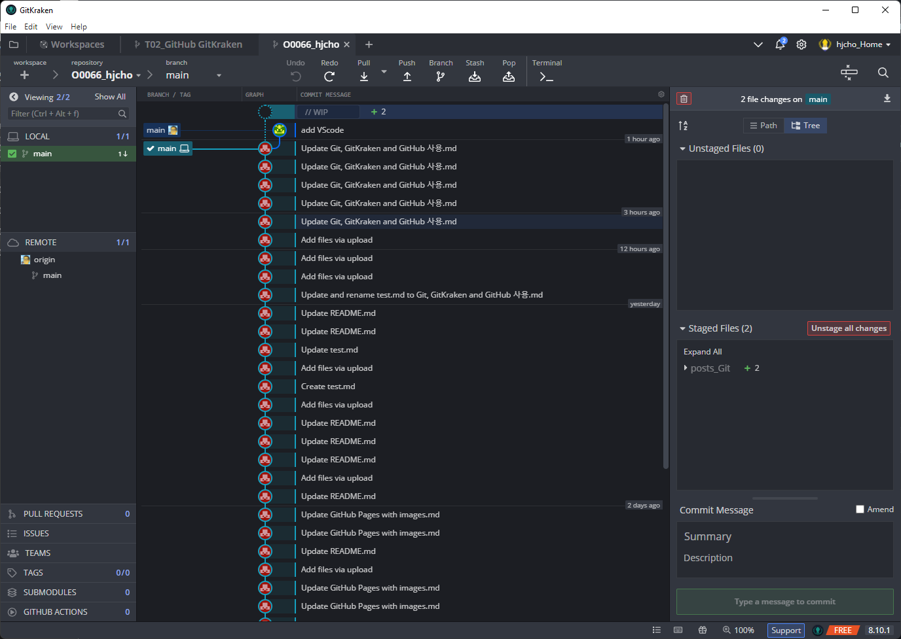

Gitkrake

로컬 repo에서 파일 내용 수정

로컬 repo에서 파일 내용 수정 후 커밋 수행 - 이후 push을 통해 리모트 repo에 동기화

만약 undo을 한다면... 리모트 repo는 최신 변경된 내용이 그대로 저장되어 있는 반면에, 로컬 리포는 파일은 수정된 채로 존재하지만 커밋은 되어 있지 않은 상태로 존재함.

만약 mac에서 수정된 내용은 어떻게 반영이 될까요?
드롭박스와의 싱크 문제가 발생하는 것 같기도 하다.