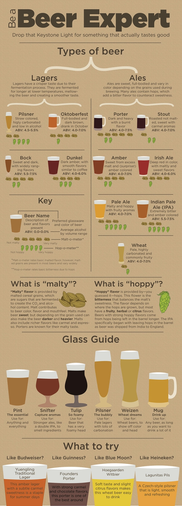
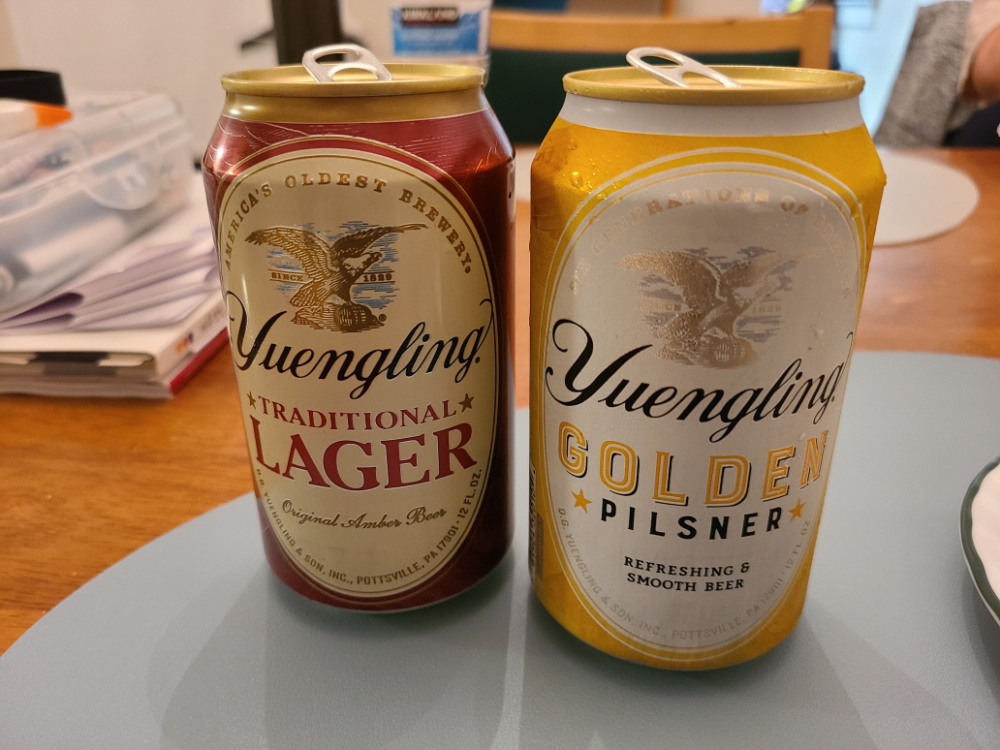
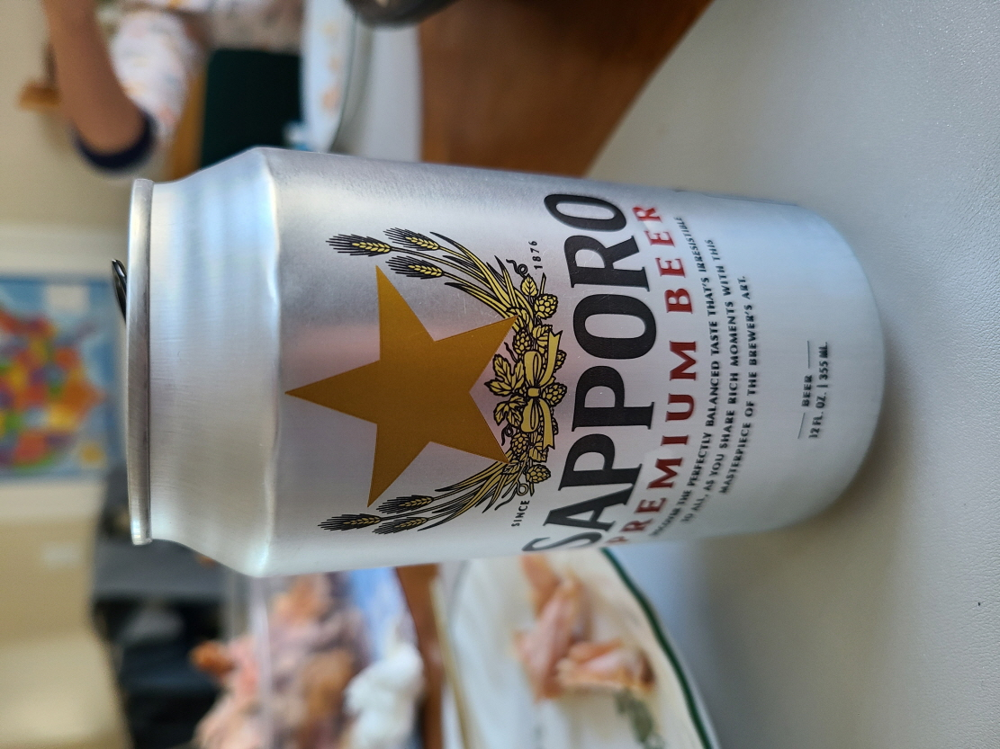
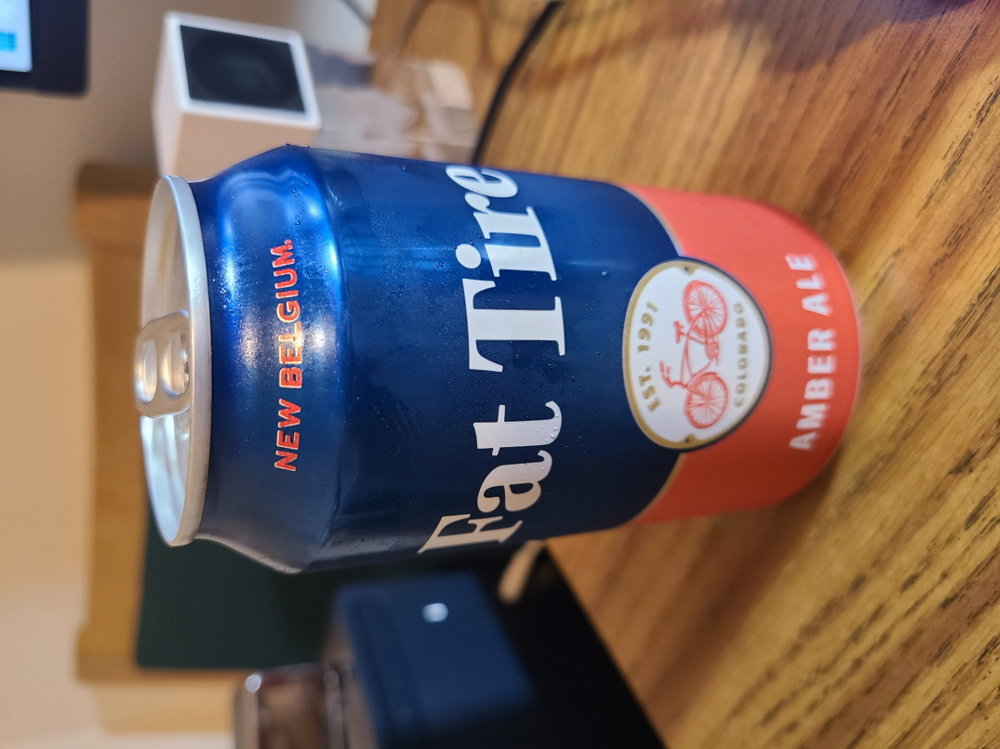

Beer Taxomony, 분류학

- 텍소모니에 따르면 비어는 라거와 에일로 구분
- 라거(Largers)는...
- 레일(Ales)은... 

Yuengling

Yuengling (이옝글링)
Yuengling Amber Lager
Yuengling Golden Pilsner

Yuengling America's Oldest Brewery
- established in 1829
- Pottsville in Pennsylvania
- https://www.yuengling.com/
- https://en.wikipedia.org/wiki/Yuengling

Sapporo

좋아라 함.

Fat Tire

좋아라 함.