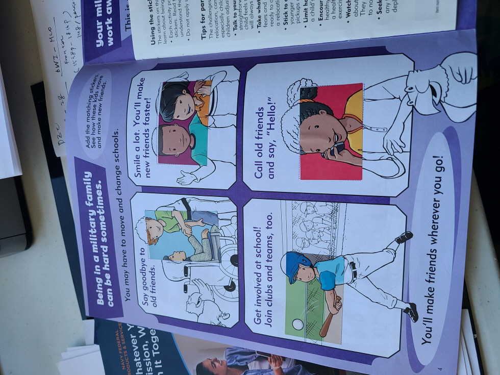

이사가서 새로운 곳에 적응하는 것에 큰 부담이 없다 생각했었는데, 나 혼자만의 생각이었는가 보다. 아니면 어렸을 때 무관심했던 센싱이 나이가 들면서 더 예민해져서 그렇게 되는 것일수도 있겠다. 자연스럽게 새로운 환경에 부담을 느끼는 자연스러운 타인의 감정 (고통)에 무관심했을 수도 있겠다는 생각이 든다. 2022년도에 미국에 와서 아! 새로운 곳에 적응을 하는 것이 나에게 더 이상 쉬운 일이 아니라는 생각이 든다: 가족들 특히, 아이들의 고충을 공감하게 된다.

한국 해군 장교들이야 고참 대위, 영관 장교 즈음되면 서로 모르는 사람이 없으니 현역 당사자들은 어디를 가든 비교적 적응을 하기 쉬울 수 있겠지만, 가족들은 그렇지 않을 수도 있겠다는 생각을 아내와 이야기하면서 알게 된다. 미군들의 경우, deployment되면 대륙 동에서 서로, 해외 파병기지에서 또 다른 기지로 옮기니 이러한 측면에 대한 배려가 훨씬 일찍부터 생겼겠구나라는 생각이 든다.

이러한 생각의 연장선에서... 미군의 가족에 대한 서포트 프로그램은 그러한 힘든 감정을 잘 보다듬어 주고 있다는 생각이 든다. 

#1.
새로운 곳에 deployment 되었을 때 가장 걱정이 되는 것은 집 문제. 관사를 확인하기 위해서 접속한 사이트의 Catchphrase에서 가정의 중요성을 다시 생각하게 만든다.

Liberty Military Housing: Every Mission Begins at Home

https://www.livelmh.com/#/

행복한 군인이 잘 싸운다는 말... 에 우리도 이에 대해 공감하고 실천하려고 한다는 분위기가 있는 듯 하다.

#2.
전입자 교육 때 포함되는 가족들 support에 대한 사항들. 베이스(기지) 부대에서 제공하는 각종 복지 시설 및 프로그램에 대한 안내가 함께 제공된다.

#3.
Some activities Book for kids.

Your military parent may need to work away from home for a while. This is called deployment.

