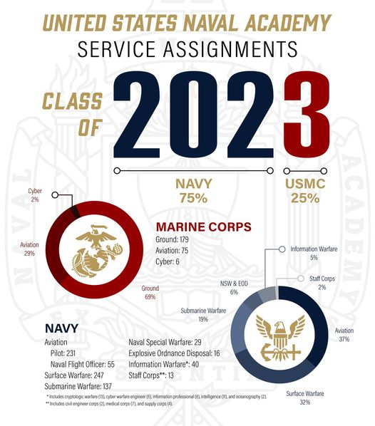

내년도 졸업 예정인 생도들(Class of 2023)을 대상으로 병과 지정 결과가 발표되었다.

몇 가지 노트
- USMC로 25% 할당되어 있지만 실제 지원, 희망하는 생도는 더욱 많다고.
- 여러 병과 중 항공 분야가 가장 인기가 많다고.
- 항공(Aciation)에는 **Pilot**이 있고 **NFO (Naval Flight Officer)**가 있음. NFO는 무장 조작사 정도.
- Surface Warfare Officer (SWO) 중에는 NukeSWO (뉵ㅋ-스워)가 있는데, 쉽게 항모타는 수상함 장교.
- 
