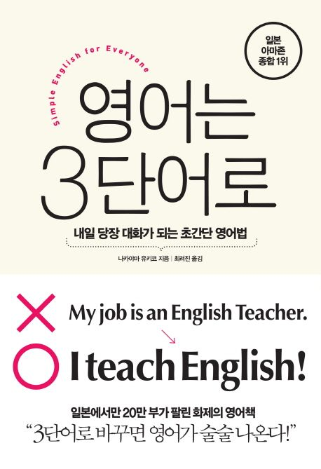

영어는 3단어로

# 시작하며
3단어를 나열하는 것만으로 충분하다 (p15) - 주어, 동사, 목적어
> - I like English
> - Smoking will active the fire alarm (alternative: If you smkire, the alarm will become active)

장문을 만들기 위해서는 상세한 정보를 계속 추가하면 된다. (p18)
- https://youtu.be/r7w_Y93V1gc

# 1장

# 2장 3단어 영어는 동사에 달렸다.
- 한 단어 동사로 스피티하게 (p53) - 3단어 영어는 동사에 달렸다. 동사는 가능한 한 구체적으로 표현되는 것을 고른다. 동사로 사용해야 할 단어가 명사형으로 숨어 있기도 한다.
> We do company visits --> We visits company

- 능동태로 짧고 강하게 (p64)
> - English can be used by anyone. --> Anyone can use English.
> - Tax is included in the price --> The price includes tax.

- 주절을 앞으로 보낸다 (p80)
> - If you have questions, you can ask now --> You can ask now if you have questions

- 동작을 주어로 한다. (p82)
> - When you touch the door handle, the door will be unlocked. --> Touching the door handle will unlock the door.

# 3장 3단어 영어를 만드는 패턴
주어는 4가지 중에서 골라라 (p93)
1. 사람
2. 사물
3. 동작
4. This: 직전에 말한 '이것'

기본 동사를 잡아라 (p101)

# 4장 3단어 영어에 정보를 더한다.

# 5장 3단어로 통하려면, 과감하게 버려라.